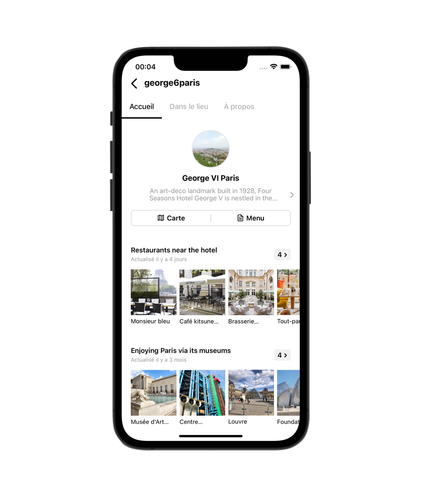
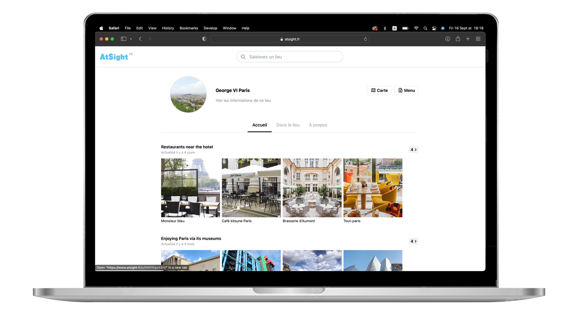
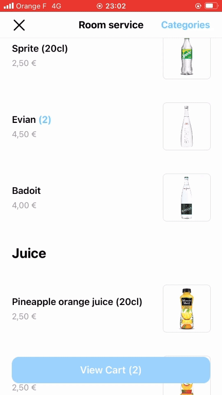

  

    
    &nbsp;&nbsp;&nbsp;
    
  

  <table>
    <tr>
      <td align="center">
        
      </td>
      <td align="center">
        
      </td>
    </tr>
  </table>

# Table of Contents
1. [Background](#background)
2. [Demo](#demo)
3. [Features](#features)
4. [Tech Stack](#tech-stack)
5. [License](#license)
6. [Conclusion](#conclusion)
   
---

## Background
*At 18, after graduating from high school and before starting university, I dedicated a year to building a fully open-source platform, available as a <u><strong>WEB APP, iOS APP, AND ANDROID APP.</strong></u>*  

*This platform empowers businesses to share information internally with customers while:*  
- *retaining data ownership* 
- *remaining ad-free*
- *maintaining minimal cost*

---

## Demo

#### Business profile page and a built-in CMS
> Shows how businesses can structure their information (timetables, addresses, categories, images) and edit it instantly through the built-in content management system.

#### Use case for Hotels
> Demonstrates how hotels can use the platform to offer all their services and information directly to guests, including room service, detailed guides, WiFi access, contact numbers and more.

#### Ordering Food from the App
> Demonstrates the ability to order food by adding items to the cart, with real-time communication support between guests and staff for order updates.

---

## Features

- **Content Organization**: Share and categorize images, text, and media in an intuitive layout
- **Knowledge Base**: Build structured guides and documentation to empower users
- **Global Reach**: Automatic translation into 70+ languages ensures worldwide accessibility
- **Smart Management**: Track engagement and optimize content with integrated analytics
- **Commerce Ready**: A seamless ordering system for products and services, enabling users to browse, select, and purchase effortlessly
- **Seamless Discovery**: Access any profile page instantly via QR code scanning, with separate secure login for account owners

---

## Tech Stack
- **Frontend**: React, React Native, Redux, Tailwind CSS
- **Backend**: Express, Node.js
- **Cloud**: AWS (DynamoDB, Cognito, S3, IAM)

---

## Conclusion

With a robust set of tools for analytics, content management, and more, it serves as a complete alternative to platforms like Instagram and Salesforce.

---

## License
[MIT License](LICENSE)
