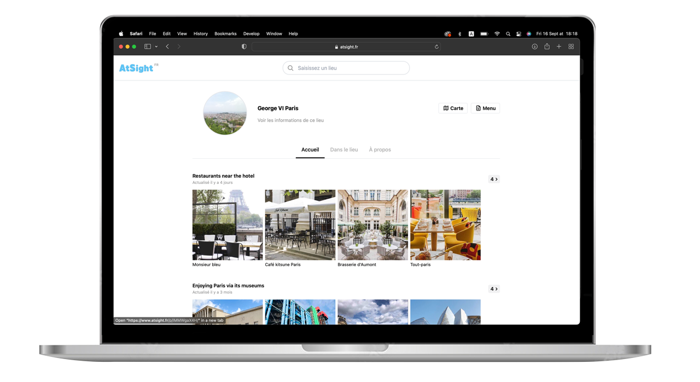

<p align="center">
  
</p>


# ABOUT THIS PROJECT
AtSight is a personnal project I worked on from scratch during one year to `learn to code` and `test my capabilities`.
This repository, contains the source code of AtSight's web version, which you can discover at : https://atsight.fr/george6paris

Technologies used in this repository include: Redux, Typescript, AWS, React and Tailwind CSS. This repository also contains a small Analytics tool that I built, which is similar to gtag.js.

More details can be found on portfolio about `my journey` and `this project` : https://nq-portfolio.com

## Additional source code
Other parts of the source code of this project are stored on private repositories but you can e-mail me at nathan.queme@gmail.com to have access to them. I am always happy to share what I learned with others! These private repositories include : 

## 1 - **The React Native app (atsight-app)**
#### - Description of the private repository `atsight-app` :
The atsight-app repository contains hundreds of files of front-end code and custom components such as buttons, modals, form inputs, etc.
#### - Testing the app
- 1 - Download the app on Google Play https://play.google.com/store/apps/details?id=com.atsight
- 2 - Type the following in the search field : ```george6paris```
- 3 - Click to open the demonstration and test the features.


## 2 - **The API** 
#### - Description:
The atsight-api repository contains backend code to handle the features of the project. This code is essentialy designed with AWS by using the NodeJs client of each service: DynamoDB, S3, Cognito, Comprehend, Amazon Translate.

### LICENSE
This project is licensed under the terms of the MIT license.
MIT License: This license allows others to copy, modify, and distribute the project, but they cannot use it commercially without permission.
 

